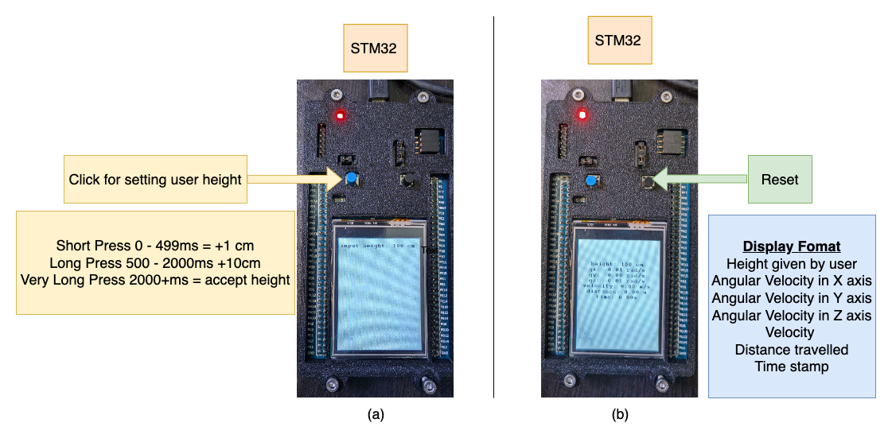

<p align="center">

  <h1 align="center">📟 Embedded-Gyrometer</h1>

  <h4 align="center"><a href="https://github.com/iamshubhamgupto">Shubham Gupta</a>, <a href="https://synkathairo.github.io">Charles Zhu</a>, <a href="https://github.com/sartak99">Sarthak Gupta</a>,</h4>

  <h5 align="center">&emsp; <a href="https://synkathairo.github.io/embedded-gyrometer/assets/pdf/Embedded_Gyrometer.pdf"> Report</a> | <a href="https://synkathairo.github.io/embedded-gyrometer/">Project Page</a></h5>

  <!-- Images container -->
  <div style="align-items: center;">
    <div style="display: flex; justify-content: center;">
        <!-- First image with title -->
        <div style="margin-right: 10px;">
        
        </div>
    </div>
    <b>Overview</b> our Embedded Challenge submission. <b>(a)</b> is the initial screen that shows when the STM32 F429 DISCOVERY board is first powered on. The user is required to use the blue button to input their height. <b>(b)</b> is the next screen that is shown once the height is accepted. The user can use the data shown on screen for their own purposes.
</div>
</p>

## Installation
**NOTE**: The instructions have been tested on a M1 Macbook pro.

We use PlatformIO and teleplot plugins on VS Code to run and compile this project.

### Environment
```commandline
git clone git@github.com:synkathairo/embedded-gyrometer.git
cd embedded-gyrometer
```

### Compile
We use the PlatformIO GUI to compile the code. We can also run the following command on the terminal:
```commandline
pio run
```
### Upload
We use the PlatformIO GUI to upload the code and use serial monitor. We can also run the following command on the terminal:
```
pio run -t upload
```

### Teleplot and monitoring
We use the Teleplot plugin on VS Code for plotting continous values. At any given time, we can use either the Teleplot or Serial monitor. The board uses a baudrate of `9600`. By default, we have dsiabled serial outputs to maximize performance. To enable serial outputs, set the `DEBUG` macro to `1` in `src/main.cpp`.

## Development
We use [pre-commit](https://pre-commit.com/index.html) to format and style our code. To contribute to this project, first clone the repository and activate the environment. Then run the following:
```
pre-commit install
```
Once the hooks are installed, continue committing to the repository as usual. The first commit will be slow.

### Key bindings
| <b> Key </b>|<b> Duration (ms) </b>|<b> Bindings </b>|
| -------------|-------------|-------------|
| blue button| 0 - 499 | + 1cm |
| blue button| 500 - 2000 | + 10cm |
| blue button| 2000+ | Accept Height |
| black button| any | Reset |

## Acknowledgments
The project uses components from the recitation lectures of Real Time Embedded Systems.

## Citation
If you find this work useful, please cite us using (bibtex):
```
Coming Soon!
```
